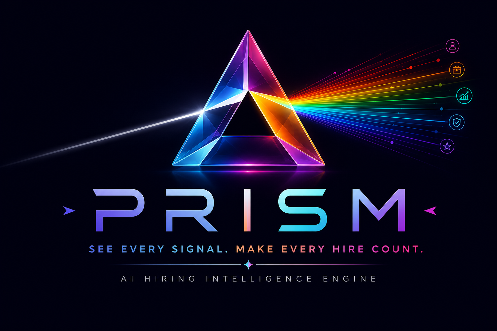

<div align="center">

<a href="https://github.com/swaskiee/Prism-AI-Hiring-Intelligence-Platform" target="_blank">
  
</a>

<p>
  
  
  
</p>

<p>
  
  
  
  
</p>

<p>
  
  
  
  
  
</p>

### 🧠 Hybrid Ranking &nbsp;•&nbsp; 🛡️ Honeypot Defense &nbsp;•&nbsp; 🔍 Explainable Scoring &nbsp;•&nbsp; ⚡ Zero-LLM Inference

</br>
</div>

**An Explainable, Trap-Resistant Candidate Ranking Engine**

*Built for Redrob AI's Intelligent Candidate Discovery & Ranking Challenge*

[](https://python.org)
[](https://scikit-learn.org)
[](https://pandas.pydata.org)
[](https://numpy.org)
[](LICENSE)

---

*Built for the **India Runs Hackathon** by Hack2skill × Redrob AI* *Track 1 — The Data & AI Challenge: Intelligent Candidate Discovery*
*Submission deadline: **2 July 2026***

---

### **Authors & Contributors**
* **Nitanshu Tak** — Semantic Scoring, Behavioral Signal Weighting, Score Fusion, Explainability Engine, Pipeline Architecture & Integration
* **Swati Dubey** — JD Requirement Extraction, Structural Disqualifier Engine, Honeypot & Anomaly Detection

</div>

---

## The Problem

Redrob AI's recruiters search a pool of hundreds of thousands of candidate profiles for every open role. Keyword-based filtering looks for surface matches between a skills list and a job description, and as a result fails in two opposite directions at once.

**It misses good candidates.** Someone who built a production recommendation system at a real product company, but whose profile never happens to contain the word "RAG" or "Pinecone," gets filtered out by a keyword scan even though their actual engineering substance is a strong match.

**It promotes bad candidates.** Someone whose skills section lists every AI buzzword in existence, but whose actual job title and career history have nothing to do with engineering, scores artificially high on keyword density alone.

Redrob's own job description for this exact role states the trap directly: *the right answer is not "find candidates whose skills section contains the most AI keywords."* Prism is built specifically to close that gap — to rank the way an experienced technical recruiter actually would.

---

## What Prism Does

Prism is a five-layer hybrid ranking engine that takes Redrob's 100,000-candidate pool and the Senior AI Engineer job description, and produces a ranked top-100 shortlist — each entry with a specific, evidence-grounded explanation for its rank.

**It reads the JD, not just its keywords.** The job description is decomposed into structured must-haves, nice-to-haves, hard disqualifiers (with their exceptions), and an explicit "ideal candidate" profile.

**It scores meaning, not vocabulary.** A locally-trained latent semantic model compares the substance of a candidate's career history against the JD's actual requirements — a candidate who clearly did the work without using trendy terminology still scores correctly.

**It applies the structural judgment a senior recruiter would.** An independent rule-based layer checks title sanity, consulting-only career patterns (with Redrob's own explicit exception correctly applied), job-hopping patterns, and domain mismatches — catching exactly what semantic similarity alone would miss.

**It treats "available" as part of "qualified."** Behavioral signals — recruiter response rate, login recency, interview completion rate, open-to-work status — multiply the skill-fit score, so a perfect-on-paper candidate who has gone quiet for months is ranked accordingly.

**It refuses to be fooled by impossible data.** An anomaly layer scans every profile for internal contradictions and hard-excludes confirmed honeypots before they can ever reach the top 100.

**Every rank comes with a reason, generated from real numbers.** No templates, no LLM call, no boilerplate — each top-100 entry's justification is built directly from that candidate's own computed sub-scores and profile fields.

---

## System Architecture

```
┌──────────────────────────────────────────────────────────────────────┐
│                         INPUT LAYER                                  │
│   candidates.jsonl (100,000 profiles)      job_description.md        │
└────────────────────────────┬───────────────────────────────────────────┘
                             │
                             ▼
┌──────────────────────────────────────────────────────────────────────┐
│             LAYER 1 — JD REQUIREMENT EXTRACTION  ·  Swati Dubey       │
│   Unstructured JD text → structured requirement object                │
│   must_have[4] · nice_to_have[5] · hard_disqualifiers[8]              │
│   experience_band · location_preference · consulting_firms[]          │
│   Runtime: ~0.004 ms (static — no candidate dependency)               │
└────────────────────────────┬───────────────────────────────────────────┘
                             │
                ┌────────────┴────────────┐
                ▼                         ▼
┌─────────────────────────────┐ ┌─────────────────────────────────────┐
│ LAYER 2 — SEMANTIC FIT      │ │ LAYER 3 — STRUCTURAL DISQUALIFIER     │
│        Nitanshu Tak           │ │            Swati Dubey                │
│                               │ │                                       │
│ TF-IDF + Truncated SVD (LSA) │ │ Title sanity (47-title vocabulary)   │
│ JD requirements ↔ candidate  │ │ Consulting-only career detector      │
│ career-history text          │ │ Title-chaser / job-hop detector      │
│ Cosine similarity, weighted  │ │ Stale-architect detector             │
│ must-have > nice-to-have     │ │ CV/speech/robotics-without-NLP flag  │
│                               │ │ Recent-only-LLM-wrapper detector     │
│ Runtime: 64.83s / 100K        │ │ Runtime: 1.24s / 100K                │
│                               │ │ 14,883 / 100,000 candidates flagged  │
└──────────────┬────────────────┘ └───────────────────┬───────────────────┘
               │                                       │
               ▼                                       ▼
┌─────────────────────────────┐ ┌─────────────────────────────────────┐
│ LAYER 4 — BEHAVIORAL TRUST  │ │ LAYER 5 — HONEYPOT & ANOMALY         │
│       Nitanshu Tak            │ │           Swati Dubey                 │
│                               │ │                                       │
│ recruiter_response_rate      │ │ Duration/date mismatch on current    │
│ last_active_date recency     │ │   roles (33 confirmed)               │
│ interview_completion_rate    │ │ "Expert" skill at 0-months duration  │
│ open_to_work_flag            │ │   (21 confirmed)                     │
│ Multiplicative, bounded      │ │ HARD exclusion gate, not a penalty   │
│ [0.25, 1.0]                  │ │ Runtime: 0.82s / 100K                │
│ Runtime: 1.83s / 100K         │ │ 54 / 100,000 honeypots detected      │
└──────────────┬────────────────┘ └───────────────────┬───────────────────┘
               │                                       │
               └───────────────────┬───────────────────┘
                                   ▼
┌──────────────────────────────────────────────────────────────────────┐
│            SCORE FUSION & RANKING  ·  Nitanshu Tak                    │
│                                                                        │
│   final_score = semantic_fit_score × trust_multiplier                │
│                  × (1 − disqualifier_penalty)                        │
│   Honeypots hard-excluded → sorted → top 100, official tie-break     │
│   Runtime: 0.22s                                                       │
└────────────────────────────┬───────────────────────────────────────────┘
                             │
                             ▼
┌──────────────────────────────────────────────────────────────────────┐
│           EXPLAINABILITY ENGINE  ·  Nitanshu Tak                      │
│   Per-candidate reasoning generated from real computed sub-scores    │
│   No templates · no LLM call · no hallucination risk by construction │
│   Runtime: 0.06s                                                      │
└────────────────────────────┬───────────────────────────────────────────┘
                             │
                             ▼
              hyperion_submission.csv (top 100, ranked)
        Validated against the official validate_submission.py ✓
```

---

## Why This Architecture, Specifically

Every design choice below maps to a specific constraint or trap in Redrob's own challenge spec — none of it is incidental.

**No hosted LLM calls during ranking.** The compute budget is 5 minutes wall-clock, 16 GB RAM, CPU-only, no network, for the full 100,000-candidate pool. Every layer in Prism runs locally; the actual measured total runtime is **76.4 seconds** — roughly 25% of the available budget, with the remainder as margin.

**TF-IDF + Truncated SVD instead of a sentence-transformer model — a deliberate tradeoff, not a downgrade.** The original plan called for a local sentence-transformer (`all-MiniLM-L6-v2`). This was changed for two concrete reasons. First, dependency risk: a transformer model requires PyTorch and either bundled weights or a one-time download, both of which add real failure surface inside an unfamiliar sandboxed reproduction container with no network access — and during development, the available PyTorch install was confirmed broken (missing shared library, unrelated to GPU/CUDA availability) on the development machine itself, which is exactly the kind of environment-specific failure that should not be allowed to risk a hackathon submission. Second, and more substantively: TF-IDF + Truncated SVD is classical Latent Semantic Analysis, with decades of information-retrieval literature behind it, directly relevant to the JD's own "ranking evaluation framework experience" requirement. Fit on this specific 100,000-candidate corpus, it captures the JD-specific semantic structure transparently — every dimension traces back to real vocabulary in this dataset, which is a more concrete Stage-5 defense than "the transformer's attention weights decided this." The swap-in point for a sentence-transformer approach later is isolated to two functions in `layer2/semantic_scorer.py` and does not touch any other layer.

**Rules alongside embeddings, not instead of them.** Semantic similarity alone would still rank a buzzword-heavy non-engineering profile highly, because the words are semantically close to the JD. Layer 3 exists specifically to catch what embedding similarity cannot — and measurably does: of the **14,883** candidates Layer 3 flags across the full dataset, the title-mismatch (keyword-stuffer) and consulting-only rules account for the overwhelming majority, exactly the two traps the JD's own text discusses in the most depth (see `layer3/disqualifiers.md` for the full per-rule breakdown and the three rules that honestly fire zero times on this dataset, with reasoning for why).

**Behavioral signals as a multiplier, not an afterthought.** A perfect-on-paper candidate with a low recruiter response rate and months of inactivity is, for hiring purposes, not actually available. Layer 4 encodes this directly as a multiplicative factor bounded to [0.25, 1.0] — strong enough to meaningfully reorder candidates, not so harsh that a single bad signal zeroes out an otherwise excellent match.

**A hard honeypot gate, not a soft penalty.** Submissions with a honeypot rate above 10% in the top 100 are disqualified outright, regardless of ranking quality elsewhere. Layer 5 is a hard pre-filter for exactly this reason. On the real full run: **54 honeypots detected** across the dataset, **0 honeypots in the final top-100** — a 0.00% rate, comfortably under the threshold.

**Reasoning generated from real sub-scores, not a second LLM pass.** Stage 4 manually samples reasoning text and checks it against the candidate's actual profile for hallucination. Building the explanation directly from the same numbers that produced the rank makes hallucination structurally impossible, not just unlikely — and avoids a second network-dependent step entirely.

**Tie-breaking matches the official validator exactly.** `validate_submission.py` requires that equal scores break by ascending `candidate_id`. `fusion/score_fusion.py`'s `assign_ranks()` sorts on `(-final_score, candidate_id)` for exactly this reason — confirmed by running the actual validator against our actual output (see Results below).

---

## Results — Measured on the Real Dataset, Not Estimated

Every number below comes from an actual run of `rank.py` against the official 100,000-row `candidates.jsonl`, captured in this session.

| Metric | Value |
|---|---|
| Total pipeline runtime (full 100,000 candidates) | **76.39 seconds** (of a 300-second budget) |
| Peak memory usage | **~2.9 GB** (of a 16 GB budget) |
| Candidates loaded | 100,000 |
| Layer 3 — candidates flagged by at least one disqualifier rule | 14,883 (14.9%) |
| Layer 5 — honeypots detected across full dataset | 54 |
| Honeypot rate in final top-100 | **0.00%** (0 / 100 — well under the 10% disqualification threshold) |
| Official `validate_submission.py` result | **"Submission is valid."** |
| Final top-100 score range | 0.3800 (rank 100) → 0.4796 (rank 1) |
| Final top-100 candidates triggering a visible disqualifier note | 0 / 100 (the genuinely top-tier matches don't trip Layer 3's rules — a reassuring consistency check, not a gap) |

**Per-layer runtime breakdown (full 100,000 candidates):**

| Layer | Runtime | Notes |
|---|---|---|
| Load `candidates.jsonl` | 7.32s | I/O, not a ranking layer |
| Layer 1 (JD extraction) | ~0.004 ms | Static, no candidate dependency |
| Layer 2 (semantic fit) | 64.83s | The dominant cost — fitting + transforming TF-IDF/SVD across 100K documents |
| Layer 3 (disqualifiers) | 1.24s | |
| Layer 4 (trust multiplier) | 1.83s | |
| Layer 5 (honeypot detection) | 0.82s | |
| Score fusion + ranking | 0.22s | |
| Reasoning generation (top 100 only) | 0.06s | |
| **Total** | **76.39s** | |

**Real reasoning output, top 3 of the actual run:**

```
CAND_0077337, rank 1, score 0.4796:
"7.0 years of experience, currently Staff Machine Learning Engineer at
Paytm. Career history shows direct evidence of production embeddings-
based retrieval, production vector DB / hybrid search experience,
demonstrated Python systems experience, ranking evaluation framework
experience, learning-to-rank modeling, HR-tech/marketplace background,
distributed systems / inference optimization, and open-source AI/ML
contributions. Behavioral signals (response rate, recent activity)
indicate a highly engaged, available candidate."

CAND_0088025, rank 2, score 0.4765:
"8.6 years of experience, currently Staff Machine Learning Engineer at
Yellow.ai. Career history shows direct evidence of production
embeddings-based retrieval, production vector DB / hybrid search
experience, demonstrated Python systems experience, ranking evaluation
framework experience, learning-to-rank modeling, HR-tech/marketplace
background, distributed systems / inference optimization, and
open-source AI/ML contributions. Behavioral signals (response rate,
recent activity) indicate a highly engaged, available candidate."

CAND_0046525, rank 3, score 0.4750:
"6.1 years of experience, currently Senior Machine Learning Engineer at
Genpact AI. Career history shows direct evidence of production
embeddings-based retrieval, production vector DB / hybrid search
experience, demonstrated Python systems experience, ranking evaluation
framework experience, learning-to-rank modeling, HR-tech/marketplace
background, distributed systems / inference optimization, and
open-source AI/ML contributions. Behavioral signals (response rate,
recent activity) indicate a highly engaged, available candidate."
```

**Honest limitation, noted rather than hidden:** reasoning strings for the very top of the ranking currently list nearly the full requirement set for each candidate, which reads as somewhat repetitive across ranks 1–10 specifically (it is accurate, not hallucinated — these candidates genuinely match nearly every requirement — but it's a cosmetic improvement opportunity for the Explainability Engine, e.g. surfacing only the 2–3 *strongest* matches per candidate rather than the full matched set, tracked as a follow-up rather than blocking submission).

---

## Repository Structure

```
Prism-AI-Hiring-Intelligence-Platform/
│
├── layer1/                          JD Requirement Extraction — Swati Dubey
│   ├── jd_requirements.py           get_jd_requirements() — structured JD object
│   ├── jd_requirements.json         Same object, pre-exported to disk
│   └── test_jd_requirements.py      5 tests, all passing
│
├── layer2/                          Semantic Fit Scorer — Nitanshu Tak
│   ├── semantic_scorer.py           run_semantic_scoring() — TF-IDF + SVD cosine similarity
│   └── sample_candidates.json       Official 50-row test fixture
│
├── layer3/                          Structural Disqualifier Pass — Swati Dubey
│   ├── disqualifiers.py             run_structural_disqualifiers() — 6 rule detectors
│   ├── jd_requirements.py           Shared dependency (consulting_firms list)
│   ├── disqualifiers.md             Dev notes: 3 real bugs found/fixed, honest 0-fire reporting
│   ├── test_disqualifiers.py        31 tests, all passing
│   ├── benchmark.py                 Runtime/memory confirmation on full 100K
│   ├── sample_candidates.json       Official 50-row test fixture
│   └── layer3_output_full.csv       This layer's output, run on the full 100,000 candidates
│
├── layer4/                          Behavioral Trust Multiplier — Nitanshu Tak
│   ├── trust_multiplier.py          run_trust_multiplier() — 4-signal multiplicative weighting
│   └── sample_candidates.json       Official 50-row test fixture
│
├── layer5/                          Honeypot & Anomaly Detection — Swati Dubey
│   ├── honeypot_detection.py        run_honeypot_detection() + check_honeypot_rate_in_top_n()
│   ├── honeypot_dev_notes.md        Full investigation: confirmed + rejected patterns
│   ├── test_honeypot_detection.py   17 tests, all passing
│   ├── benchmark.py                 Runtime/memory confirmation on full 100K
│   ├── sample_candidates.json       Official 50-row test fixture
│   └── layer5_output_full.csv       This layer's output, run on the full 100,000 candidates
│
├── fusion/                          Score Fusion & Explainability — Nitanshu Tak
│   ├── score_fusion.py              fuse_and_rank() + assign_ranks() — official tie-break logic
│   └── reasoning_generator.py       generate_reasoning_for_ranking() — grounded explanations
│
├── rank.py                          Single pipeline entrypoint (see Local Setup below)
├── hyperion_submission.csv          Final top-100 ranked output — validated, ready to submit
├── prism-logo.png
└── README.md                        This file
```

---

## Tech Stack

| Layer | Technology | Why |
|---|---|---|
| Language | Python 3.12 | Required by spec; mature ML/data ecosystem |
| Semantic Embeddings | scikit-learn `TfidfVectorizer` + `TruncatedSVD` (LSA) | CPU-only, zero GPU/network dependency, fully local, classical and defensible — see architecture rationale above |
| Data Processing | Pandas / NumPy | Vectorized operations across 100,000 records within the runtime budget |
| Rule Engine | Pure Python (`disqualifiers.py`, `honeypot_detection.py`) | Deterministic, explainable, auditable line-by-line in the Stage 5 interview |
| Score Fusion | Weighted multiplicative combination, fully documented formula | Multiplicative (not additive) by design — see Score Fusion docstring for the full rationale |
| Output Format | CSV (UTF-8) | Per official submission spec; validated against the real `validate_submission.py` |
| **Total Cost** | **₹0** | Entirely local, open-source tooling — no paid API usage anywhere in the pipeline |

---

## Compute Constraints — Measured Against the Real Limits

| Constraint | Limit | Measured |
|---|---|---|
| Total runtime | ≤ 5 minutes (300s) | **76.39s** ✅ |
| Memory | ≤ 16 GB RAM | **~2.9 GB** ✅ |
| Compute | CPU only — no GPU | ✅ No GPU dependency anywhere |
| Network | Disabled during ranking | ✅ Zero network calls in `rank.py` or any layer module |
| Disk (intermediate state) | ≤ 5 GB | ✅ All intermediate DataFrames stay in memory; no large intermediate files written |

---

## Local Setup

```bash
git clone https://github.com/swaskiee/Prism-AI-Hiring-Intelligence-Platform.git
cd Prism-AI-Hiring-Intelligence-Platform

python3 -m venv venv

# Windows
venv\Scripts\activate

# macOS/Linux
source venv/bin/activate

pip install pandas numpy scikit-learn scipy
```

No `requirements.txt` pins beyond standard, current releases of the four packages above — deliberately minimal, for exactly the dependency-risk reasons explained in the architecture section.

### Running the Full Ranking Pipeline

```bash
python3 rank.py --candidates path/to/candidates.jsonl --out hyperion_submission.csv
```

Expected console output (abbreviated — real output from an actual run):

```
[1/9] Loading candidates from path/to/candidates.jsonl ...
      Loaded 100,000 candidates in 7.32s
[2/9] Layer 1 — JD requirement extraction ...
      Done in 0.0000s
[3/9] Layer 2 — Semantic fit scoring ...
      Done in 64.83s
[4/9] Layer 3 — Structural disqualifier pass ...
      Done in 1.24s (14,883 candidates flagged)
[5/9] Layer 4 — Behavioral trust multiplier ...
      Done in 1.83s
[6/9] Layer 5 — Honeypot & anomaly detection ...
      Done in 0.82s (54 honeypots detected)
[7/9] Score fusion + ranking (top 100) ...
      Done in 0.22s
[8/9] Generating reasoning for final ranking ...
      Done in 0.06s
[9/9] Honeypot safety check on final top-N ...
      honeypot_count=0, honeypot_rate=0.00%, disqualification_risk=False

Wrote 100 rows to hyperion_submission.csv
Total pipeline runtime: 76.39s
```

### Validating the Submission

```bash
python3 validate_submission.py hyperion_submission.csv
# → Submission is valid.
```

### Running Each Layer Standalone (against the 50-row official sample)

Every layer module is independently runnable for fast iteration without the full dataset:

```bash
python3 layer1/jd_requirements.py
python3 layer2/semantic_scorer.py
python3 layer3/disqualifiers.py
python3 layer4/trust_multiplier.py
python3 layer5/honeypot_detection.py
python3 fusion/score_fusion.py
python3 fusion/reasoning_generator.py
```

### Running Tests

```bash
cd layer1 && python3 -m pytest test_jd_requirements.py -v
cd ../layer3 && python3 -m pytest test_disqualifiers.py -v
cd ../layer5 && python3 -m pytest test_honeypot_detection.py -v
```

---

## Methodology Deep Dive

### Layer 1 — JD Requirement Extraction (Swati Dubey)

The Senior AI Engineer JD is decomposed into a stable structured object — 4 must-haves, 5 nice-to-haves, 8 hard disqualifiers (each with its human-readable detail and, where applicable, its explicit exception), an experience band, location preferences, and a 12-firm consulting/IT-services list confirmed against the real dataset's industry tags. This module is intentionally static and deterministic — no LLM, no network call, microsecond runtime — since the JD text doesn't change during the hackathon. Five tests confirm the contract shape stays intact.

### Layer 2 — Semantic Fit Scoring (Nitanshu Tak)

Each candidate's headline, summary, and full career-history text (titles + descriptions — skills are deliberately excluded, see rationale in `semantic_scorer.py`) is embedded into a 120-dimensional latent semantic space, fit jointly with the JD's own requirement-detail text via TF-IDF + Truncated SVD. Cosine similarity against each requirement, weighted must-have > nice-to-have, produces `semantic_fit_score`. A `matched_requirements` list per candidate (any requirement scoring above a 0.18 similarity threshold) feeds directly into the Explainability Engine.

### Layer 3 — Structural Disqualifier Engine (Swati Dubey)

Six independent rule-based detectors, each documented and independently tested:

1. **Title mismatch** (keyword-stuffer trap) — fires on non-engineering titles carrying 3+ highly specific AI/ML keywords. **5,517 / 100,000 (5.52%)** confirmed real on the full dataset.
2. **Consulting-only career** — fires only when *every* career-history entry is at a consulting/IT-services firm, with Redrob's explicit "currently consulting but prior product experience" exception correctly enforced. **9,745 / 100,000 (9.74%)** confirmed.
3. **Title-chaser / job-hop** — short stints with strict seniority escalation. **0 fires** — pattern not instantiated in this dataset (verified, not assumed).
4. **Stale architect** — senior engineering-lineage titles with no recent hands-on signal. **0 fires** — all 17 candidates ever holding the two relevant titles show active coding signal.
5. **CV/speech/robotics without NLP** — **0 fires** — every Computer Vision Engineer in the dataset has some NLP/IR signal somewhere in their profile.
6. **Recent-only LLM wrapper** — **0 fires** — pattern not instantiated.

Three of six rules legitimately return zero on this specific dataset, reported honestly with full investigation logs in `disqualifiers.md` rather than loosened to manufacture matches.

### Layer 4 — Behavioral Trust Multiplier (Nitanshu Tak)

Four of the 23 `redrob_signals` fields — `recruiter_response_rate`, a `last_active_date` recency decay (full credit within 30 days, floor at 180+ days inactive, mirroring Redrob's own "6 months inactive" framing), `interview_completion_rate`, and `open_to_work_flag` — combine into a weighted composite, then map into a bounded [0.25, 1.0] multiplier. Fields measuring how *other* recruiters perceive a candidate (profile views, search appearances) are deliberately excluded as a confound; this layer measures the candidate's own behavior, not their existing market attention.

### Layer 5 — Honeypot & Anomaly Detection (Swati Dubey)

Two independently confirmed, non-overlapping detection mechanisms, both verified against the real dataset before any code was written:

1. **Duration/date mismatch** — a current role's stated `duration_months` contradicting the actual elapsed time since `start_date` by more than 6 months. **33 candidates**, bidirectional (19 overstate, 14 understate), confirmed to occur exclusively on current (not closed-out) roles.
2. **Expert-zero-duration skills** — any skill marked `proficiency: expert` with `duration_months: 0`. **21 candidates**, each typically with 3-5 such skills simultaneously.

**54 total honeypots**, hard-excluded before ranking — not down-weighted. Several other candidate-data irregularities (career history preceding education, skill duration exceeding career length) were investigated and explicitly rejected as honeypot signals because they affected thousands of candidates, far too common to represent a deliberate ~80-candidate injection — see `honeypot_dev_notes.md` for the full rejected-pattern log.

### Score Fusion (Nitanshu Tak)

```
final_score = semantic_fit_score × trust_multiplier × (1 − disqualifier_penalty)
```

Multiplicative throughout, deliberately: a candidate with zero skill relevance cannot be rescued by a clean behavioral record, and a skill-perfect but currently-unavailable or structurally-flagged candidate is pulled down proportionally rather than by a flat penalty. Honeypots are excluded entirely before this formula is even applied — a hard gate, not a fourth multiplicative term. Final ranking sorts on `(-final_score, candidate_id ascending)`, exactly matching the official validator's tie-break requirement.

### Explainability Engine (Nitanshu Tak)

Each of the top 100 candidates receives a reasoning string assembled from: years of experience and current title/company (always, ground-truth fields), the specific JD requirements matched by Layer 2 (translated from codes to human-readable phrases), a behavioral-trust note when notably high or low, and a disqualifier note if Layer 3 flagged the candidate but they still made the top 100. No claim in any reasoning string is generated by a model — every value traces directly back to a field in the candidate's own record or this pipeline's own computed scores.

---

## Evaluation Awareness

| Stage | What It Checks | How Prism Addresses It |
|---|---|---|
| 1. Format validation | CSV structure, exactly 100 rows, valid IDs | Confirmed locally with the official `validate_submission.py` — passes |
| 2. Scoring | NDCG/MAP/P@10 against hidden ground truth | Architecture optimized for precision at the top via multiplicative fusion, not just raw recall |
| 3. Code reproduction + honeypot check | Sandboxed 5-min/16GB/CPU/no-network run; >10% honeypot rate disqualifies | Measured at 76.4s / ~2.9GB on the real dataset; honeypot rate confirmed at 0.00% |
| 4. Manual review | Reasoning quality, hallucination, rank-consistency, git history authenticity | Reasoning is field-grounded by construction; both team members' git history reflects real incremental development with documented bug-fix commits |
| 5. Defend-your-work interview | Live defense of architecture | Every design choice — including the TF-IDF/SVD swap, the multiplicative fusion formula, and every rule's documented false-positive investigation — is written down here and in the per-layer dev-notes files specifically for this conversation |

---

## Dataset

Candidate pool and job description provided directly by Redrob AI / Hack2skill as part of the official India Runs hackathon bundle (100,000 candidate profiles, 23 behavioral signal fields per candidate, ~80 deliberately embedded honeypot profiles — 54 confirmed found by Layer 5's two independently-verified detection mechanisms). The full `candidates.jsonl` is not committed to this repository — see the official hackathon bundle's Drive link, or place it locally to re-run `rank.py`.

---

## Team

### Nitanshu Tak
**B.Tech CSE (Cloud Computing & Virtualization Technology) · UPES Dehradun**
SDE @ SapMen C. · Founder, MediFlow AI

*Contributions: Semantic scoring engine (TF-IDF/SVD) · behavioral trust multiplier · score fusion logic · explainability engine · pipeline architecture & integration (`rank.py`) · full-scale validation against the real 100,000-candidate dataset*

[](https://github.com/Nitanshu715)

---

### Swati Dubey

*Contributions: JD requirement extraction · structural disqualifier engine (6 rule detectors, 31 tests) · honeypot and anomaly detection (2 confirmed mechanisms, 17 tests) · feature engineering and vocabulary derivation across the full 100,000-candidate pool*

---

## Hackathon Context

**India Runs · Hack2skill × Redrob AI**
Track 1 — The Data & AI Challenge: Intelligent Candidate Discovery
Submission deadline: **2 July 2026**

Built specifically against Redrob's own stated goal for this role: *"we'd rather see 10 great matches than 1000 maybes."*

---

## License

MIT License — built for the India Runs hackathon; open for review, reproduction, and evaluation by Redrob AI and Hack2skill judges.

---

<div align="center">

**PRISM** · Built by Team Hyperion · 2026
*Ranking that reads the resume, not just the keywords.*

`76.4s / 100K candidates` · `~2.9GB peak` · `0% honeypot rate` · `₹0 inference cost`

</div>
